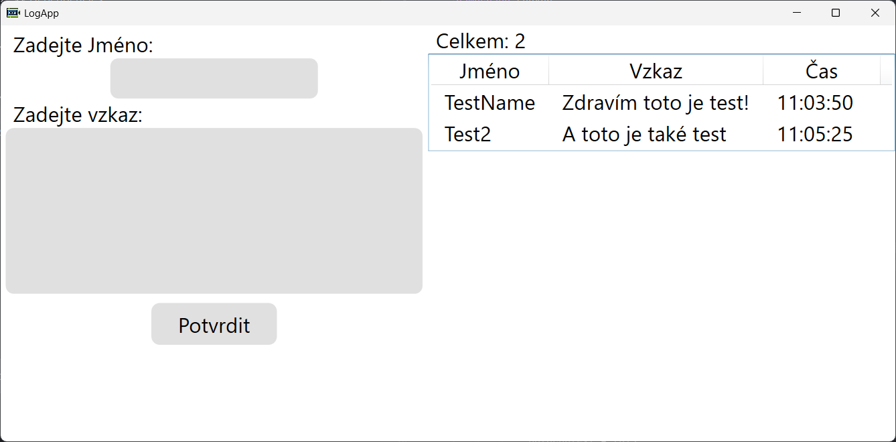
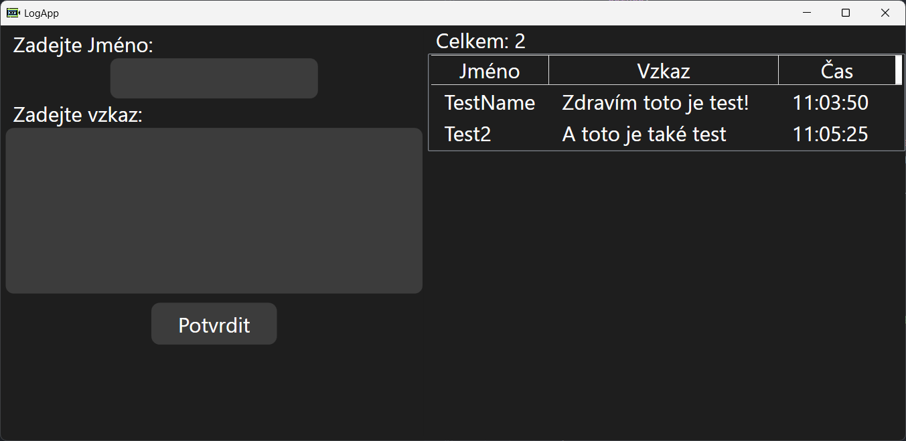

# LogApp

LogApp is a simple desktop application for managing and storing logs. It allows users to enter names and messages, which are automatically saved to a JSON file. The application supports dark and light modes, adapting to the system settings.

---

## Application Features

### 1. **Saving and Loading Logs**
   - Logs are saved to a `log.json` file in JSON format.
   - Each log contains:
     - **Name** (`Name`) – entered by the user
     - **Message** (`Message`) – entered by the user
     - **Date** (`Date`) – automatically generated in `yyyy-MM-dd` format
     - **Time** (`Time`) – automatically generated in `HH:mm:ss` format
   - When the application starts, logs are automatically loaded from the `log.json` file and displayed in a list.

### 2. **User Interface**
   - **Main Window**:
     - Fields for entering a name (`NameBox`) and a message (`NoteBox`).
     - A "Confirm" button to save the log.
     - A list of logs displayed in a `ListView` with the following columns:
       - **Name**: The name of the entry
       - **Message**: The message (with text wrapping support)
       - **Time**: The time of the entry
   - **Log Count**: Displayed at the top of the list (e.g., "Total: 5").

### 3. **Dark and Light Mode Support**
   - The application automatically detects whether the system is in dark or light mode and adapts accordingly.
   - Themes are defined in the `Themes/Light.xaml` and `Themes/Dark.xaml` files.
   - Background, text, and control colors change based on the selected mode.

   **Light Mode Preview**:
   

   **Dark Mode Preview**:
   

---

## Code Description

### **MainWindow.xaml.cs**
This file contains the logic for the main window of the application.

- **`Log` Class**:
  ```csharp
  public class Log
  {
      public string? Name { get; set; }
      public string? Message { get; set; }
      public string? Date { get; set; } = DateTime.Now.ToString("yyyy-MM-dd");
      public string? Time { get; set; } = DateTime.Now.ToString("HH:mm:ss");
  }
  ```
  - Defines the structure of a log with properties for name, message, date, and time.

- **`LoadLogs` Method**:
  ```csharp
  private async Task LoadLogs()
  {
      try
      {
          if (File.Exists(FilePath))
          {
              string json = await File.ReadAllTextAsync(FilePath);
              if (!string.IsNullOrEmpty(json))
              {
                  var logs = JsonSerializer.Deserialize<List<Log>>(json) ?? new();
                  Logs!.Clear();
                  logs.ForEach(Logs.Add);
              }
              Counter.Text = $"Total: {Logs!.Count}";
          }
      }
      catch (Exception ex)
      {
          MessageBox.Show($"Error while loading logs: {ex.Message}", "Error", MessageBoxButton.OK);
      }
  }
  ```
  - Loads logs from the `log.json` file and displays them in the list.

- **`ButtonBase_OnClick` Method**:
  ```csharp
  private async void ButtonBase_OnClick(object sender, RoutedEventArgs e)
  {
      try
      {
          if (string.IsNullOrEmpty(NameBox.Text))
          {
              MessageBox.Show("Name must be filled", "Error", MessageBoxButton.OK);
              return;
          }
          var log = new Log
          {
              Name = NameBox.Text,
              Message = NoteBox.Text
          };
          Logs!.Add(log);
          var options = new JsonSerializerOptions { WriteIndented = true };
          string jsonString = JsonSerializer.Serialize(Logs, options);
          await File.WriteAllTextAsync(FilePath, jsonString);
          await LoadLogs();
          NameBox.Clear();
          NoteBox.Clear();
      }
      catch (Exception ex)
      {
          MessageBox.Show($"Error while saving log: {ex.Message}", "Error", MessageBoxButton.OK);
      }
  }
  ```
  - Saves a new log to the `log.json` file and updates the list.

- **`CreateJsonFileIfNotExists` Method**:
  ```csharp
  private void CreateJsonFileIfNotExists()
  {
      if (!File.Exists(FilePath))
      {
          try
          {
              var emptyLogs = new List<Log>();
              string emptyJson = JsonSerializer.Serialize(emptyLogs,
                  new JsonSerializerOptions { WriteIndented = true });
              File.WriteAllText(FilePath, emptyJson);
              MessageBox.Show("File with connections created successfully", "Success", MessageBoxButton.OK);
          }
          catch (Exception ex)
          {
              MessageBox.Show($"Error while creating file with connections: {ex.Message}", "Error", MessageBoxButton.OK);
          }
      }
  }
  ```
  - Creates the `log.json` file if it does not exist.

### **App.xaml.cs**
This file contains the application logic, including dark mode detection.

- **`ApplyTheme` Method**:
  ```csharp
  private void ApplyTheme()
  {
      bool isDarkMode = IsDarkModeEnabled();
      string theme = isDarkMode ? "Themes/Dark.xaml" : "Themes/Light.xaml";
      var dictionary = new ResourceDictionary
      {
          Source = new Uri(theme, UriKind.Relative)
      };
      Current.Resources.MergedDictionaries.Clear();
      Current.Resources.MergedDictionaries.Add(dictionary);
  }
  ```
  - Applies the theme based on the system settings.

- **`IsDarkModeEnabled` Method**:
  ```csharp
  private bool IsDarkModeEnabled()
  {
      const string registryKeyPath = @"Software\Microsoft\Windows\CurrentVersion\Themes\Personalize";
      const string registryValueName = "AppsUseLightTheme";

      using (var key = Registry.CurrentUser.OpenSubKey(registryKeyPath))
      {
          if (key != null && key.GetValue(registryValueName) is int value)
          {
              return value == 0;
          }
      }
      return false;
  }
  ```
  - Detects whether the system is in dark mode.

### **Themes/Light.xaml and Themes/Dark.xaml**
These files define the colors and styles for the light and dark modes.

- **Light Mode**:
  - Background color: `#FFFFFF`
  - Text color: `#000000`
  - Control color: `#E0E0E0`

- **Dark Mode**:
  - Background color: `#1E1E1E`
  - Text color: `#FFFFFF`
  - Control color: `#3C3C3C`

---

## How to Use

1. **Entering a Log**:
   - Enter a name in the "Enter name" field.
   - Enter a message in the "Enter message" field.
   - Click the "Confirm" button.

2. **Viewing Logs**:
   - After saving, logs are displayed in the list on the right side of the application.

3. **Switching Modes**:
   - The application automatically adapts to the system settings. To change the mode, adjust the system settings.

---

## Conclusion

LogApp is a simple yet effective application for managing logs. With automatic saving, loading, and support for dark/light modes, it is ideal for everyday use.
