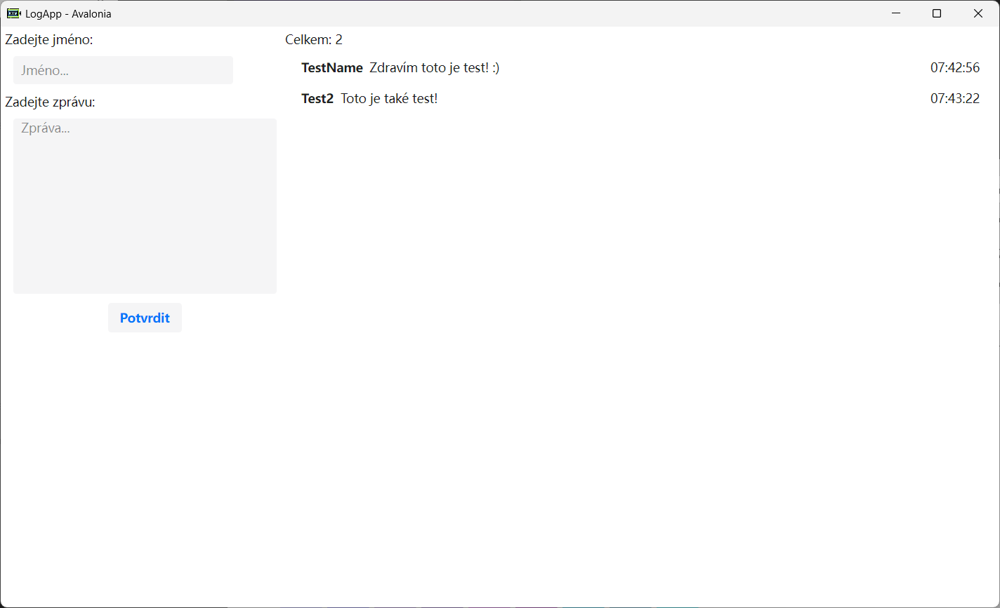
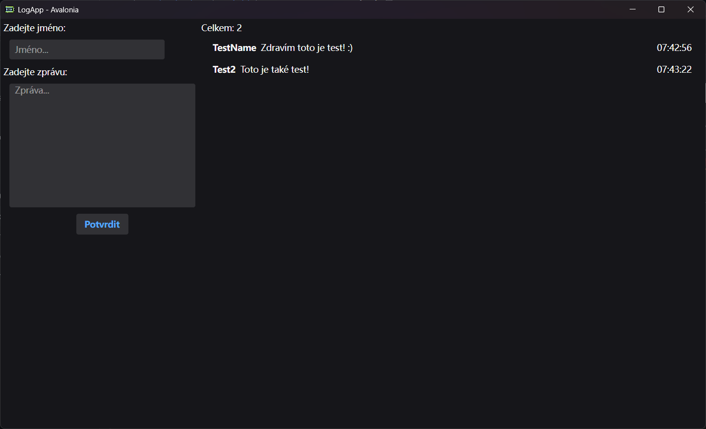

# LogApp - AvaloniaUI

LogApp is a simple desktop application built with AvaloniaUI for managing and storing logs. It allows users to enter names and messages, which are automatically saved to a JSON file. The application supports dark and light modes, adapting to the system settings.

---

## Application Features

### 1. **Saving and Loading Logs**
   - Logs are saved to a `log.json` file in JSON format.
   - Each log contains:
     - **Name** (`Name`) – entered by the user
     - **Message** (`Message`) – entered by the user
     - **Date** (`Date`) – automatically generated in `yyyy-MM-dd` format
     - **Time** (`Time`) – automatically generated in `HH:mm:ss` format
   - When the application starts, logs are automatically loaded from the `log.json` file and displayed in a list.

### 2. **User Interface**
   - **Main Window**:
     - Fields for entering a name (`NameBox`) and a message (`NoteBox`).
     - A "Confirm" button to save the log.
     - A list of logs displayed in a `ListBox` with the following columns:
       - **Name**: The name of the entry
       - **Message**: The message (with text wrapping support)
       - **Time**: The time of the entry
   - **Log Count**: Displayed at the top of the list (e.g., "Total: 5").

### 3. **Dark and Light Mode Support**
   - The application automatically detects whether the system is in dark or light mode and adapts accordingly.
   - Themes are defined using the `SemiTheme` library, which provides a consistent look and feel.
   - The `RequestedThemeVariant="Default"` setting in `App.axaml` ensures the application follows the system theme.

   **Light Mode Preview**:
   

   **Dark Mode Preview**:
   

---

## Code Description

### **App.axaml**
This file defines the application's theme and styles.

```xml
<Application xmlns="https://github.com/avaloniaui"
             xmlns:x="http://schemas.microsoft.com/winfx/2006/xaml"
             x:Class="LogApp_Avalonia.App"
             RequestedThemeVariant="Default"
             xmlns:semi="https://irihi.tech/semi">
             <!-- "Default" ThemeVariant follows system theme variant. "Dark" or "Light" are other available options. -->

    <Application.Styles>
        <semi:SemiTheme Locale="En" />
        <StyleInclude Source="avares://Semi.Avalonia.DataGrid/Index.axaml" />
    </Application.Styles>
</Application>
```

### **App.axaml.cs**
This file contains the application initialization logic.

```csharp
using Avalonia;
using Avalonia.Controls.ApplicationLifetimes;
using Avalonia.Markup.Xaml;

namespace LogApp_Avalonia;

public partial class App : Application
{
    public override void Initialize()
    {
        AvaloniaXamlLoader.Load(this);
    }

    public override void OnFrameworkInitializationCompleted()
    {
        if (ApplicationLifetime is IClassicDesktopStyleApplicationLifetime desktop)
        {
            desktop.MainWindow = new MainWindow();
        }

        base.OnFrameworkInitializationCompleted();
    }
}
```

### **MainWindow.axaml**
This file defines the main window's user interface.

```xml
<Window xmlns="https://github.com/avaloniaui"
        xmlns:x="http://schemas.microsoft.com/winfx/2006/xaml"
        xmlns:d="http://schemas.microsoft.com/expression/blend/2008"
        xmlns:mc="http://schemas.openxmlformats.org/markup-compatibility/2006"
        xmlns:local="clr-namespace:LogApp_Avalonia"
        mc:Ignorable="d" d:DesignWidth="800" d:DesignHeight="450"
        x:Class="LogApp_Avalonia.MainWindow"
        Title="LogApp - Avalonia"
        Icon="Resources/counter.png"
        x:DataType="local:MainWindow">
    <Grid ColumnDefinitions="Auto, *" Margin="5">
        <Grid Grid.Column="0" RowDefinitions="Auto, Auto, Auto">
            <StackPanel Grid.Row="0">
                <TextBlock Text="Enter name:"/>
                <TextBox x:Name="NameBox" Margin="10" Watermark="Name..." Width="250" MaxLength="30" HorizontalAlignment="Left" VerticalAlignment="Center"/>
            </StackPanel>
            <StackPanel Grid.Row="1">
                <TextBlock Text="Enter message"/>
                <TextBox x:Name="NoteBox" Margin="10" Watermark="Message..." Width="300" Height="200" VerticalContentAlignment="Top" TextWrapping="Wrap" MaxLength="120"/>
            </StackPanel>
            <Button Grid.Row="2" Content="Confirm" Click="ButtonBase_OnClick"/>
        </Grid>
        <StackPanel Grid.Column="1">
            <TextBlock x:Name="Counter" Text="Celkem: 0"></TextBlock>
            <ListBox ItemsSource="{Binding Logs}" Margin="5">
                <ListBox.ItemTemplate>
                    <DataTemplate>
                        <Grid ColumnDefinitions="Auto, *, Auto" >
                            <TextBlock Grid.Column="0" Text="{Binding Name}" Margin="2,0" FontWeight="Bold" TextWrapping="Wrap" MaxWidth="120"/>
                            <TextBlock Grid.Column="1" Text="{Binding Message}" Margin="4,0" TextWrapping="Wrap"/>
                            <TextBlock Grid.Column="2" Text="{Binding Time}" Margin="2,0"/>
                        </Grid>
                    </DataTemplate>
                </ListBox.ItemTemplate>
            </ListBox>
        </StackPanel>
    </Grid>
</Window>
```

### **MainWindow.axaml.cs**
This file contains the logic for the main window.

```csharp
using System;
using System.Collections.Generic;
using System.Collections.ObjectModel;
using System.IO;
using System.Text.Json;
using System.Threading.Tasks;
using Avalonia.Controls;
using Avalonia.Interactivity;
using MsBox.Avalonia;

namespace LogApp_Avalonia;

public partial class MainWindow : Window
{
    private string FilePath { get; set; } = "./log.json";

    public class Log
    {
        public string? Name { get; set; }
        public string? Message { get; set; }
        public string? Date { get; set; } = DateTime.Now.ToString("yyyy-MM-dd");
        public string? Time { get; set; } = DateTime.Now.ToString("HH:mm:ss");
    }

    public ObservableCollection<Log>? Logs { get; set; } = new();

    public MainWindow()
    {
        InitializeComponent();
        DataContext = this;
        CreateJsonFileIfNotExists();
        _ = LoadLogs();
    }

    private async Task LoadLogs()
    {
        try
        {
            if (File.Exists(FilePath))
            {
                string json = await File.ReadAllTextAsync(FilePath);
                if (!string.IsNullOrEmpty(json))
                {
                    var logs = JsonSerializer.Deserialize<List<Log>>(json) ?? new();
                    Logs!.Clear();
                    logs.ForEach(Logs.Add);
                }
                Counter.Text = $"Total: {Logs!.Count}";
            }
        }
        catch (Exception ex)
        {
            await MessageBoxManager.GetMessageBoxStandard("Error", $"Error while loading logs: {ex.Message}").ShowAsync();
        }
    }

    private async void ButtonBase_OnClick(object sender, RoutedEventArgs e)
    {
        try
        {
            if (string.IsNullOrEmpty(NameBox.Text))
            {
                await MessageBoxManager.GetMessageBoxStandard("Error", "Name must be filled").ShowAsync();
                return;
            }
            var log = new Log
            {
                Name = NameBox.Text,
                Message = NoteBox.Text
            };
            Logs!.Add(log);
            var options = new JsonSerializerOptions { WriteIndented = true };
            string jsonString = JsonSerializer.Serialize(Logs, options);
            await File.WriteAllTextAsync(FilePath, jsonString);
            await LoadLogs();
            NameBox.Clear();
            NoteBox.Clear();
        }
        catch (Exception ex)
        {
            await MessageBoxManager.GetMessageBoxStandard("Error", $"Error while saving log: {ex.Message}").ShowAsync();
        }
    }

    private void CreateJsonFileIfNotExists()
    {
        if (!File.Exists(FilePath))
        {
            try
            {
                var emptyLogs = new List<Log>();
                string emptyJson = JsonSerializer.Serialize(emptyLogs,
                    new JsonSerializerOptions { WriteIndented = true });
                File.WriteAllText(FilePath, emptyJson);
                MessageBoxManager.GetMessageBoxStandard("Success", "File for logs created successfully").ShowAsync();
            }
            catch (Exception ex)
            {
                MessageBoxManager.GetMessageBoxStandard("Error", $"Error while creating file with connections: {ex.Message}").ShowAsync();
            }
        }
    }
}
```

### **Program.cs**
This file contains the entry point for the application.

```csharp
using Avalonia;
using System;

namespace LogApp_Avalonia;

class Program
{
    // Initialization code. Don't use any Avalonia, third-party APIs or any
    // SynchronizationContext-reliant code before AppMain is called: things aren't initialized
    // yet and stuff might break.
    [STAThread]
    public static void Main(string[] args) => BuildAvaloniaApp()
        .StartWithClassicDesktopLifetime(args);

    // Avalonia configuration, don't remove; also used by visual designer.
    public static AppBuilder BuildAvaloniaApp()
        => AppBuilder.Configure<App>()
            .UsePlatformDetect()
            .WithInterFont()
            .LogToTrace();
}
```

---

## How to Use

1. **Entering a Log**:
   - Enter a name in the "Enter name" field.
   - Enter a message in the "Enter message" field.
   - Click the "Confirm" button.

2. **Viewing Logs**:
   - After saving, logs are displayed in the list on the right side of the application.

3. **Switching Modes**:
   - The application automatically adapts to the system settings. To change the mode, adjust the system settings.

---

## Conclusion

LogApp is a simple yet effective application for managing logs. With automatic saving, loading, and support for dark/light modes, it is ideal for everyday use.
